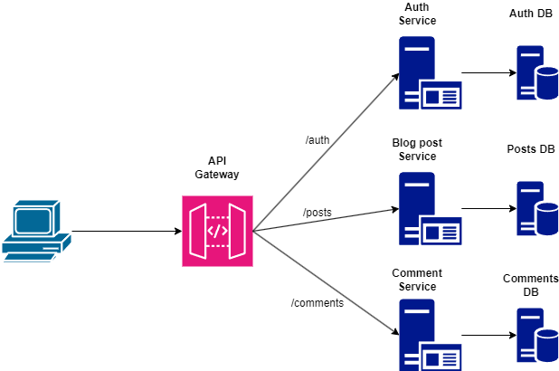
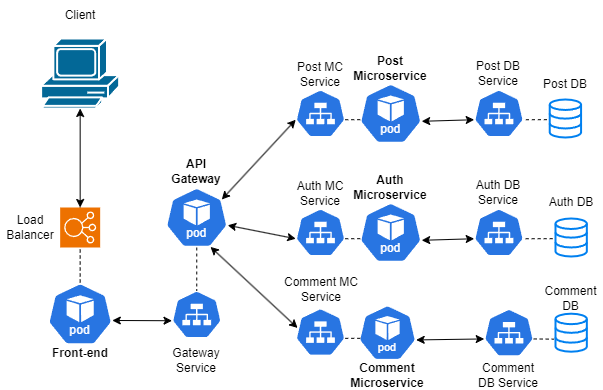

# Deploying and monitoring Microservices with Kubernetes, Prometheus and Grafana

## ⓘ About
In this project, we developed a full-stack web app using the microservices architecture, and deployed it to a Kubernetes cluster. We also setup a monitoring system for the cluster with Prometheus and Grafana.

## ▶️ Demo
You can find the full demo for this project [here](https://youtu.be/xrzwsUPCGbo).

## 🖥️ Microservices app architecture

<p align="center">
    
</p>

The web app used for deployment is a simple blogging website, with the back-end divided into 3 microservices.
The architecture of the app is as following:
+ **Front-end**: ReactJS, handle UI and user interactivity.
+ **API Gateway**: NodeJS, redirects requests/responses from front-end to back-end and vice versa.
+ **Back-end**: ExpressJS, consists of 3 microservices:
    + Auth service: Responsible for user authentication
    + Post service: Handles creation, deletion and information of blog posts
    + Comment service: Manages comments on each post
+ **Database**: MongoDB, one for each microservice

## 🗜️ Deployment model

<p align="center">
    
</p>

The K8S deployment for the app consists of the following components:
+ **3 PVC** and **3 PV**: Persistent volumes for each database.
+ **8 Pod**: Run front-end, API gateway, 3 microservices and their respective databases.
+ **8 Service**: One for each pod, only the service for front-end is a LoadBalancer, the rest are ClusterIP.
+ **1 ConfigMap** & **1 Secret**: Contains configuration URL for connecting components and secrets.

## ☸️ App Deployment
We have used [Minikube](https://minikube.sigs.k8s.io/docs/) and [Amazon EKS](https://aws.amazon.com/vi/eks/) for the deployment.
To run the app on a Kubernetes cluster, we run the `kubectl apply` command on each resource YAML file resides [here](./kubernetes/).
```
kubectl apply -f file-name.yaml
```
The order of deployment is as follows:
1. ConfigMap & Secret
2. Data volume
3. Databases
4. Microservices & API gateway
5. Front-end

##### Checking the app
If you use Minikube, you must expose the front-end's LoadBalancer service to access it.
```
minikube service frontend-svc
```
If you use EKS, simply access the LoadBalancer's external IP provided by Amazon.

## 📺 Monitor system
To setup Prometheus and Grafan, simply use the commands provided in [monitor-cmd.txt](./monitor-cmd.txt).
***Note***: The installation commands require [Helm](https://helm.sh/), make sure you install it first.